# Jornadas MyFit - Diagramas Mermaid

> **Última atualização:** 2026-02-02 (v1.0.0+29)
> **Status:** Todos os fluxos abaixo estão implementados (95%+ de cobertura)

> Para visualizar estes diagramas:
> - **Online**: Cole em [mermaid.live](https://mermaid.live)
> - **VS Code**: Extensão "Markdown Preview Mermaid Support"
> - **GitHub/GitLab**: Renderiza automaticamente em arquivos .md

| Jornada | Diagramas | Status |
|---------|-----------|--------|
| 1. Cadastro | 4 diagramas (escolha perfil, personal, aluno, complemento) | ✅ Implementado |
| 2. Convites | 3 diagramas (fluxo completo, lembretes, estados) | ✅ Implementado |
| 3. Criação de Planos | 4 diagramas (início, estrutura, exercício, estados) | ✅ Implementado |
| 4. Prescrição | 4 diagramas (fluxo, config, pós-prescrição, versionamento) | ✅ Implementado |
| 5. Acompanhamento | 5 diagramas (visão geral, treino, feedback, dashboard, co-treino) | ✅ Implementado |
| 6. Notificações | 4 diagramas (categorias, lembrete, fluxo, configurações) | ✅ Implementado |

---

## 1. Jornada de Cadastro

### 1.1 Fluxo Geral - Escolha de Perfil

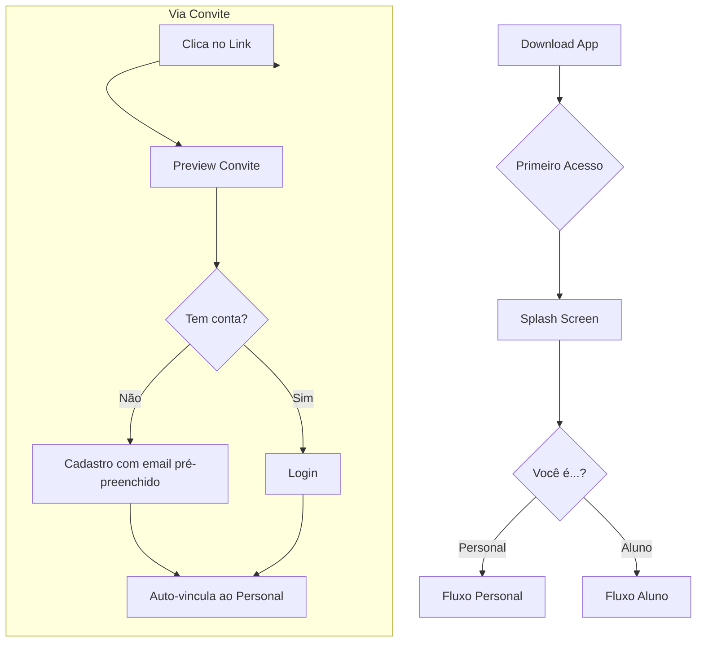
```mermaid
flowchart TD
    A[Download App] --> B{Primeiro Acesso}
    B --> C[Splash Screen]
    C --> D{Você é...?}
    D -->|Personal| E[Fluxo Personal]
    D -->|Aluno| F[Fluxo Aluno]

    subgraph convite[Via Convite]
        G[Clica no Link] --> H[Preview Convite]
        H --> I{Tem conta?}
        I -->|Não| J[Cadastro com email pré-preenchido]
        I -->|Sim| K[Login]
        J --> L[Auto-vincula ao Personal]
        K --> L
    end

    G --> convite
```

### 1.2 Fluxo Personal - Cadastro Completo

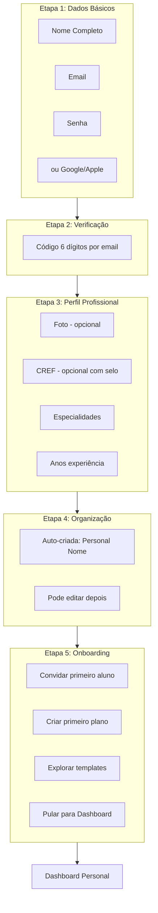
```mermaid
flowchart TD
    subgraph cadastro[Etapa 1: Dados Básicos]
        A1[Nome Completo]
        A2[Email]
        A3[Senha]
        A4[ou Google/Apple]
    end

    subgraph verificacao[Etapa 2: Verificação]
        B1[Código 6 dígitos por email]
    end

    subgraph perfil[Etapa 3: Perfil Profissional]
        C1[Foto - opcional]
        C2[CREF - opcional com selo]
        C3[Especialidades]
        C4[Anos experiência]
    end

    subgraph org[Etapa 4: Organização]
        D1[Auto-criada: Personal Nome]
        D2[Pode editar depois]
    end

    subgraph onboarding[Etapa 5: Onboarding]
        E1[Convidar primeiro aluno]
        E2[Criar primeiro plano]
        E3[Explorar templates]
        E4[Pular para Dashboard]
    end

    cadastro --> verificacao
    verificacao --> perfil
    perfil --> org
    org --> onboarding
    onboarding --> F[Dashboard Personal]
```

### 1.3 Fluxo Aluno - 3 Caminhos

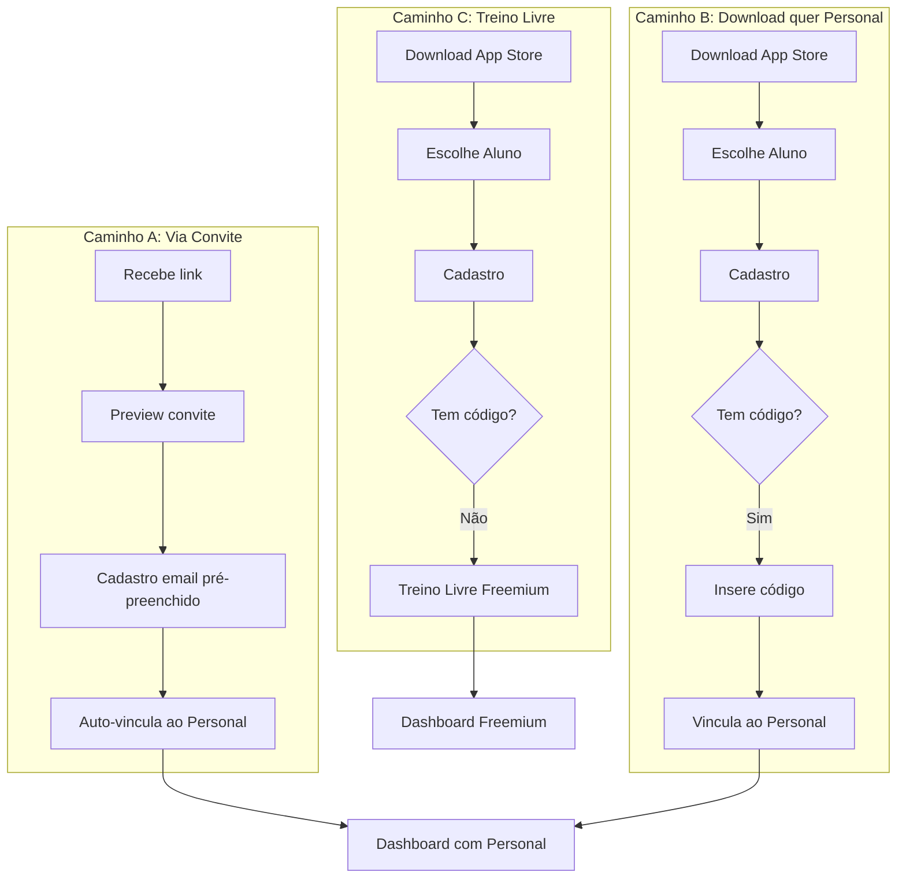
```mermaid
flowchart TD
    subgraph caminhoA[Caminho A: Via Convite]
        A1[Recebe link] --> A2[Preview convite]
        A2 --> A3[Cadastro email pré-preenchido]
        A3 --> A4[Auto-vincula ao Personal]
    end

    subgraph caminhoB[Caminho B: Download quer Personal]
        B1[Download App Store] --> B2[Escolhe Aluno]
        B2 --> B3[Cadastro]
        B3 --> B4{Tem código?}
        B4 -->|Sim| B5[Insere código]
        B5 --> B6[Vincula ao Personal]
    end

    subgraph caminhoC[Caminho C: Treino Livre]
        C1[Download App Store] --> C2[Escolhe Aluno]
        C2 --> C3[Cadastro]
        C3 --> C4{Tem código?}
        C4 -->|Não| C5[Treino Livre Freemium]
    end

    A4 --> D[Dashboard com Personal]
    B6 --> D
    C5 --> E[Dashboard Freemium]
```

### 1.4 Complemento de Perfil - Primeiro Login

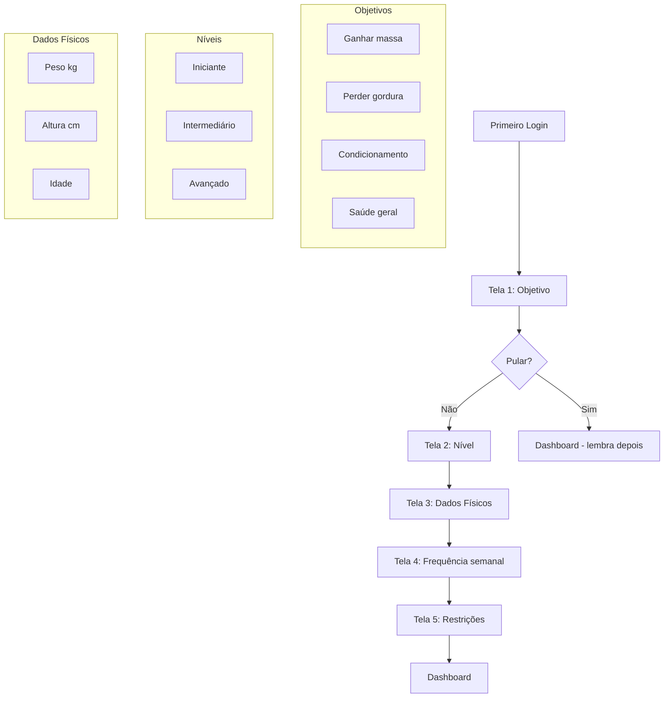
```mermaid
flowchart TD
    A[Primeiro Login] --> B[Tela 1: Objetivo]
    B --> C{Pular?}
    C -->|Não| D[Tela 2: Nível]
    C -->|Sim| Z[Dashboard - lembra depois]
    D --> E[Tela 3: Dados Físicos]
    E --> F[Tela 4: Frequência semanal]
    F --> G[Tela 5: Restrições]
    G --> H[Dashboard]

    subgraph objetivo[Objetivos]
        B1[Ganhar massa]
        B2[Perder gordura]
        B3[Condicionamento]
        B4[Saúde geral]
    end

    subgraph nivel[Níveis]
        D1[Iniciante]
        D2[Intermediário]
        D3[Avançado]
    end

    subgraph dados[Dados Físicos]
        E1[Peso kg]
        E2[Altura cm]
        E3[Idade]
    end
```

---

## 2. Jornada de Convites

### 2.1 Fluxo Completo de Convite

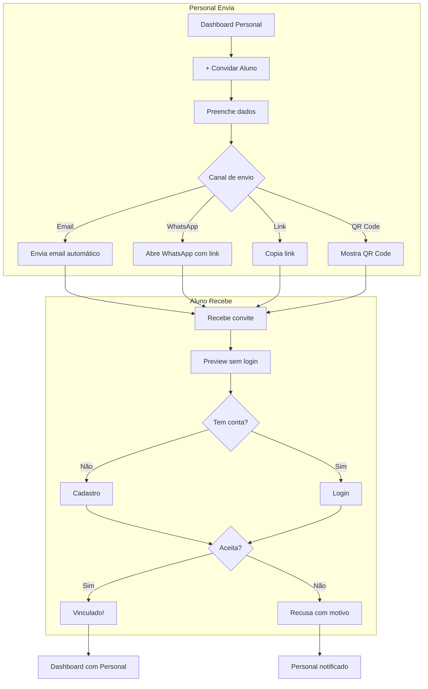
```mermaid
flowchart TD
    subgraph personal[Personal Envia]
        A[Dashboard Personal] --> B[+ Convidar Aluno]
        B --> C[Preenche dados]
        C --> D{Canal de envio}
        D -->|Email| E1[Envia email automático]
        D -->|WhatsApp| E2[Abre WhatsApp com link]
        D -->|Link| E3[Copia link]
        D -->|QR Code| E4[Mostra QR Code]
    end

    subgraph aluno[Aluno Recebe]
        F[Recebe convite] --> G[Preview sem login]
        G --> H{Tem conta?}
        H -->|Não| I[Cadastro]
        H -->|Sim| J[Login]
        I --> K{Aceita?}
        J --> K
        K -->|Sim| L[Vinculado!]
        K -->|Não| M[Recusa com motivo]
    end

    E1 --> F
    E2 --> F
    E3 --> F
    E4 --> F

    L --> N[Dashboard com Personal]
    M --> O[Personal notificado]
```

### 2.2 Sistema de Lembretes

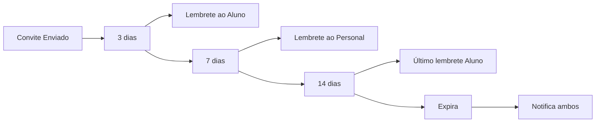
```mermaid
flowchart LR
    A[Convite Enviado] --> B[3 dias]
    B --> C[Lembrete ao Aluno]
    B --> D[7 dias]
    D --> E[Lembrete ao Personal]
    D --> F[14 dias]
    F --> G[Último lembrete Aluno]
    F --> H[Expira]
    H --> I[Notifica ambos]
```

### 2.3 Estados do Convite

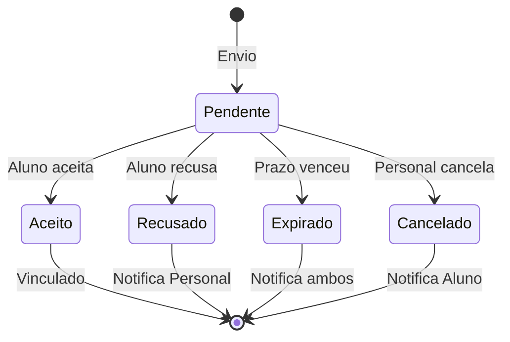
```mermaid
stateDiagram-v2
    [*] --> Pendente: Envio
    Pendente --> Aceito: Aluno aceita
    Pendente --> Recusado: Aluno recusa
    Pendente --> Expirado: Prazo venceu
    Pendente --> Cancelado: Personal cancela

    Aceito --> [*]: Vinculado
    Recusado --> [*]: Notifica Personal
    Expirado --> [*]: Notifica ambos
    Cancelado --> [*]: Notifica Aluno
```

---

## 3. Jornada de Criação de Planos

### 3.1 Início da Criação

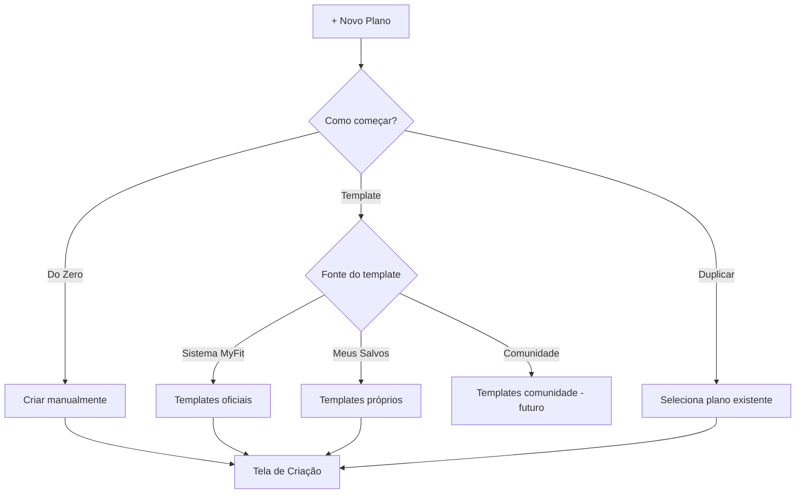
```mermaid
flowchart TD
    A[+ Novo Plano] --> B{Como começar?}
    B -->|Do Zero| C[Criar manualmente]
    B -->|Template| D{Fonte do template}
    B -->|Duplicar| E[Seleciona plano existente]

    D -->|Sistema MyFit| F[Templates oficiais]
    D -->|Meus Salvos| G[Templates próprios]
    D -->|Comunidade| H[Templates comunidade - futuro]

    C --> I[Tela de Criação]
    F --> I
    G --> I
    E --> I
```

### 3.2 Estrutura do Plano

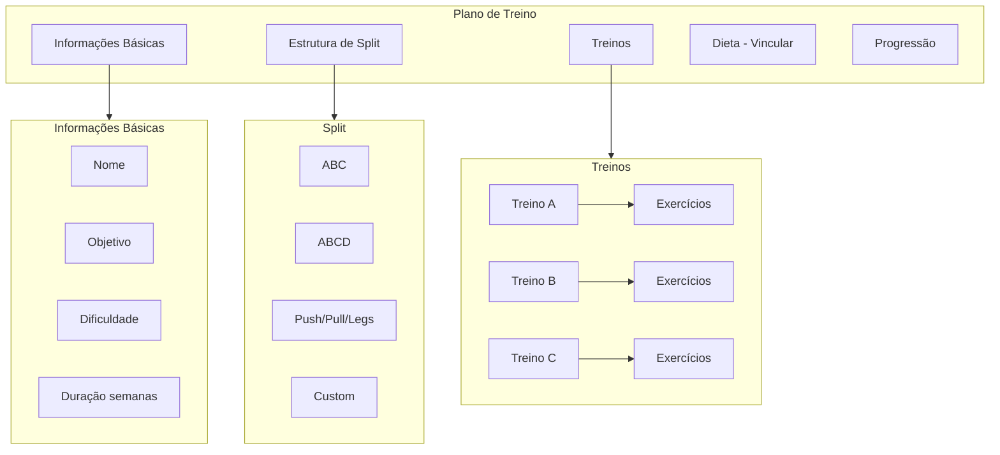
```mermaid
flowchart TD
    subgraph plano[Plano de Treino]
        A[Informações Básicas]
        B[Estrutura de Split]
        C[Treinos]
        D[Dieta - Vincular]
        E[Progressão]
    end

    subgraph info[Informações Básicas]
        A1[Nome]
        A2[Objetivo]
        A3[Dificuldade]
        A4[Duração semanas]
    end

    subgraph split[Split]
        B1[ABC]
        B2[ABCD]
        B3[Push/Pull/Legs]
        B4[Custom]
    end

    subgraph treinos[Treinos]
        C1[Treino A] --> C1a[Exercícios]
        C2[Treino B] --> C2a[Exercícios]
        C3[Treino C] --> C3a[Exercícios]
    end

    A --> info
    B --> split
    C --> treinos
```

### 3.3 Configuração de Exercício

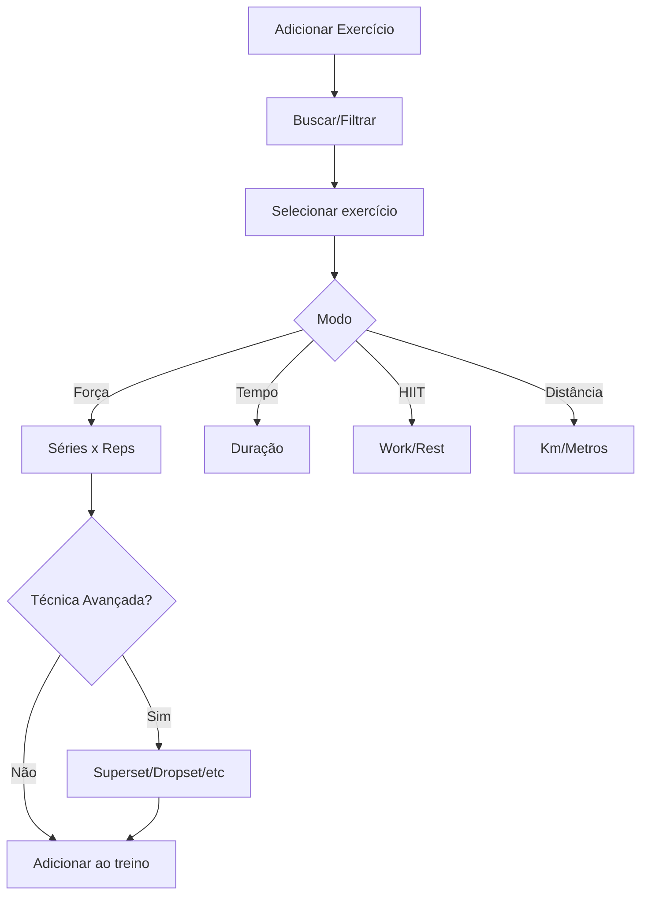
```mermaid
flowchart TD
    A[Adicionar Exercício] --> B[Buscar/Filtrar]
    B --> C[Selecionar exercício]
    C --> D{Modo}

    D -->|Força| E1[Séries x Reps]
    D -->|Tempo| E2[Duração]
    D -->|HIIT| E3[Work/Rest]
    D -->|Distância| E4[Km/Metros]

    E1 --> F{Técnica Avançada?}
    F -->|Sim| G[Superset/Dropset/etc]
    F -->|Não| H[Adicionar ao treino]
    G --> H
```

### 3.4 Estados do Plano

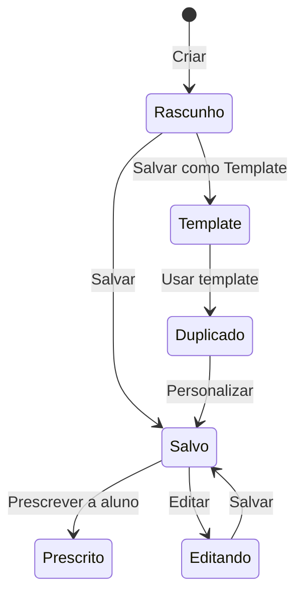
```mermaid
stateDiagram-v2
    [*] --> Rascunho: Criar
    Rascunho --> Salvo: Salvar
    Rascunho --> Template: Salvar como Template
    Salvo --> Prescrito: Prescrever a aluno
    Salvo --> Editando: Editar
    Editando --> Salvo: Salvar
    Template --> Duplicado: Usar template
    Duplicado --> Salvo: Personalizar
```

---

## 4. Jornada de Prescrição

### 4.1 Fluxo de Prescrição

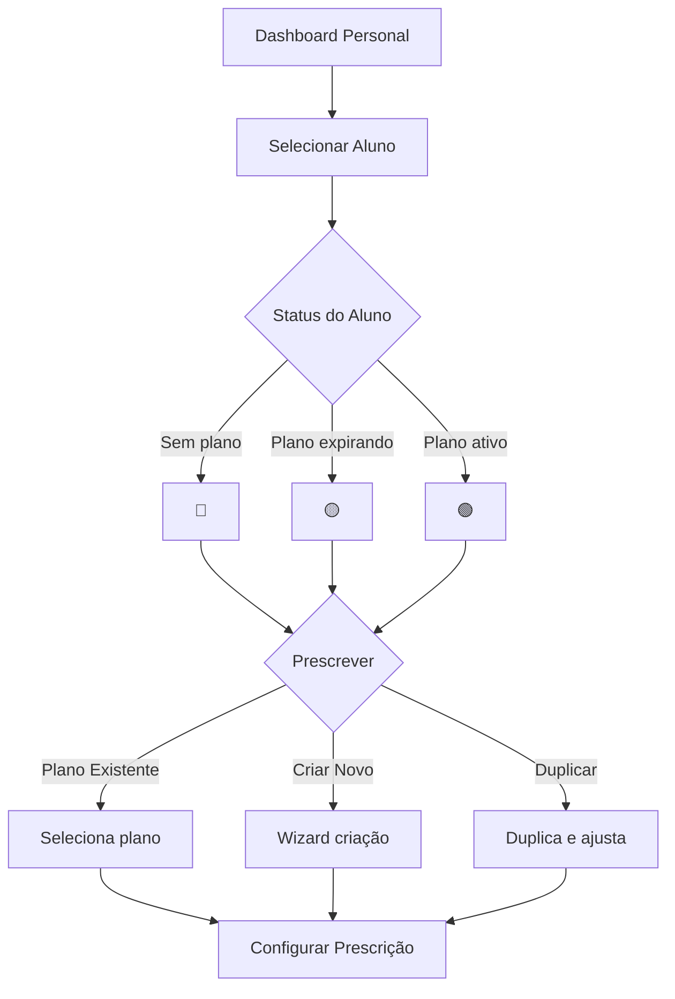
```mermaid
flowchart TD
    A[Dashboard Personal] --> B[Selecionar Aluno]
    B --> C{Status do Aluno}
    C -->|Sem plano| D[🔴]
    C -->|Plano expirando| E[🟡]
    C -->|Plano ativo| F[🟢]

    D --> G{Prescrever}
    E --> G
    F --> G

    G -->|Plano Existente| H[Seleciona plano]
    G -->|Criar Novo| I[Wizard criação]
    G -->|Duplicar| J[Duplica e ajusta]

    H --> K[Configurar Prescrição]
    I --> K
    J --> K
```

### 4.2 Configuração da Prescrição

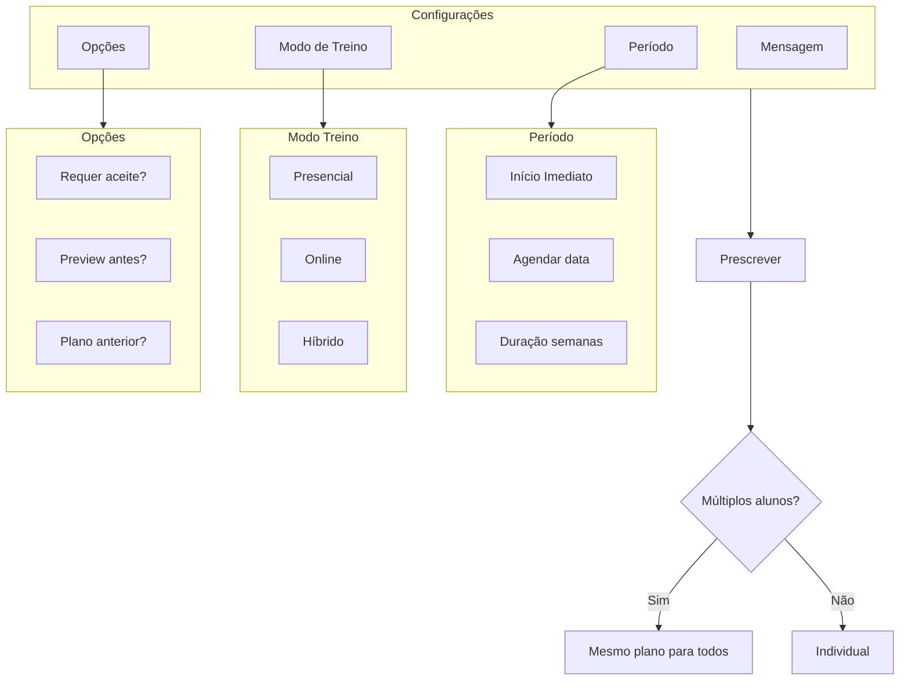
```mermaid
flowchart TD
    subgraph config[Configurações]
        A[Período]
        B[Modo de Treino]
        C[Opções]
        D[Mensagem]
    end

    subgraph periodo[Período]
        A1[Início Imediato]
        A2[Agendar data]
        A3[Duração semanas]
    end

    subgraph modo[Modo Treino]
        B1[Presencial]
        B2[Online]
        B3[Híbrido]
    end

    subgraph opcoes[Opções]
        C1[Requer aceite?]
        C2[Preview antes?]
        C3[Plano anterior?]
    end

    A --> periodo
    B --> modo
    C --> opcoes

    config --> E[Prescrever]
    E --> F{Múltiplos alunos?}
    F -->|Sim| G[Mesmo plano para todos]
    F -->|Não| H[Individual]
```

### 4.3 Fluxo Pós-Prescrição

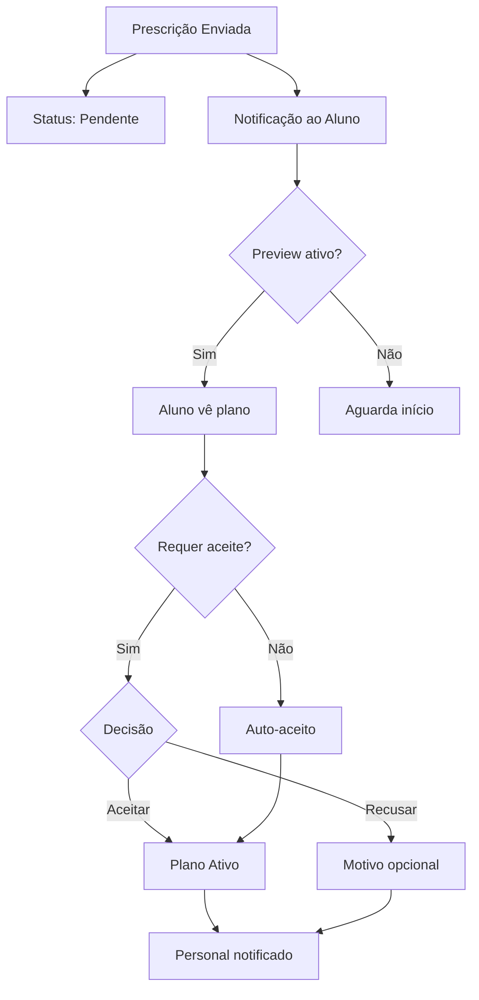
```mermaid
flowchart TD
    A[Prescrição Enviada] --> B[Status: Pendente]
    A --> C[Notificação ao Aluno]

    C --> D{Preview ativo?}
    D -->|Sim| E[Aluno vê plano]
    D -->|Não| F[Aguarda início]

    E --> G{Requer aceite?}
    G -->|Sim| H{Decisão}
    G -->|Não| I[Auto-aceito]

    H -->|Aceitar| J[Plano Ativo]
    H -->|Recusar| K[Motivo opcional]

    J --> L[Personal notificado]
    K --> L
    I --> J
```

### 4.4 Versionamento de Ajustes

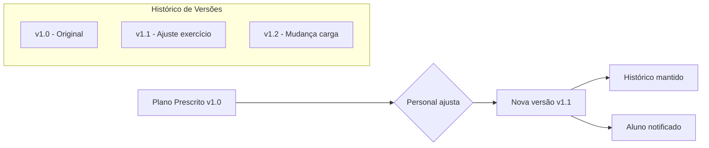
```mermaid
flowchart LR
    A[Plano Prescrito v1.0] --> B{Personal ajusta}
    B --> C[Nova versão v1.1]
    C --> D[Histórico mantido]
    C --> E[Aluno notificado]

    subgraph historico[Histórico de Versões]
        H1[v1.0 - Original]
        H2[v1.1 - Ajuste exercício]
        H3[v1.2 - Mudança carga]
    end
```

---

## 5. Jornada de Acompanhamento

### 5.1 Visão Geral do Sistema

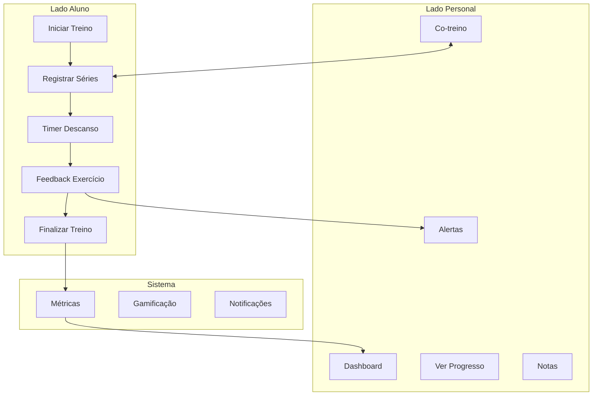
```mermaid
flowchart TD
    subgraph aluno[Lado Aluno]
        A1[Iniciar Treino]
        A2[Registrar Séries]
        A3[Timer Descanso]
        A4[Feedback Exercício]
        A5[Finalizar Treino]
    end

    subgraph personal[Lado Personal]
        P1[Dashboard]
        P2[Ver Progresso]
        P3[Alertas]
        P4[Co-treino]
        P5[Notas]
    end

    subgraph sistema[Sistema]
        S1[Métricas]
        S2[Gamificação]
        S3[Notificações]
    end

    A1 --> A2 --> A3 --> A4 --> A5
    A5 --> S1
    S1 --> P1
    A4 --> P3

    P4 <--> A2
```

### 5.2 Fluxo Durante o Treino

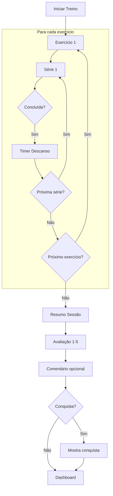
```mermaid
flowchart TD
    A[Iniciar Treino] --> B[Exercício 1]

    subgraph exercicio[Para cada exercício]
        B --> C[Série 1]
        C --> D{Concluída?}
        D -->|Sim| E[Timer Descanso]
        E --> F{Próxima série?}
        F -->|Sim| C
        F -->|Não| G{Próximo exercício?}
    end

    G -->|Sim| B
    G -->|Não| H[Resumo Sessão]
    H --> I[Avaliação 1-5]
    I --> J[Comentário opcional]
    J --> K{Conquista?}
    K -->|Sim| L[Mostra conquista]
    K -->|Não| M[Dashboard]
    L --> M
```

### 5.3 Sistema de Feedback

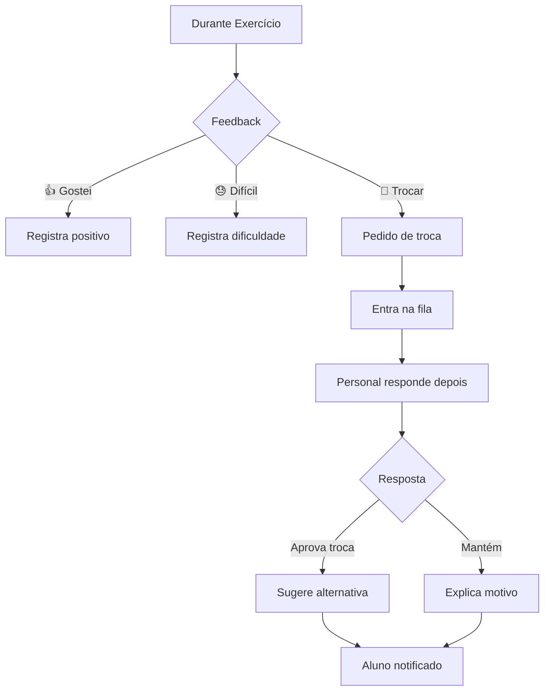
```mermaid
flowchart TD
    A[Durante Exercício] --> B{Feedback}
    B -->|👍 Gostei| C[Registra positivo]
    B -->|😓 Difícil| D[Registra dificuldade]
    B -->|🔄 Trocar| E[Pedido de troca]

    E --> F[Entra na fila]
    F --> G[Personal responde depois]
    G --> H{Resposta}
    H -->|Aprova troca| I[Sugere alternativa]
    H -->|Mantém| J[Explica motivo]

    I --> K[Aluno notificado]
    J --> K
```

### 5.4 Dashboard Personal - Visão de Alunos

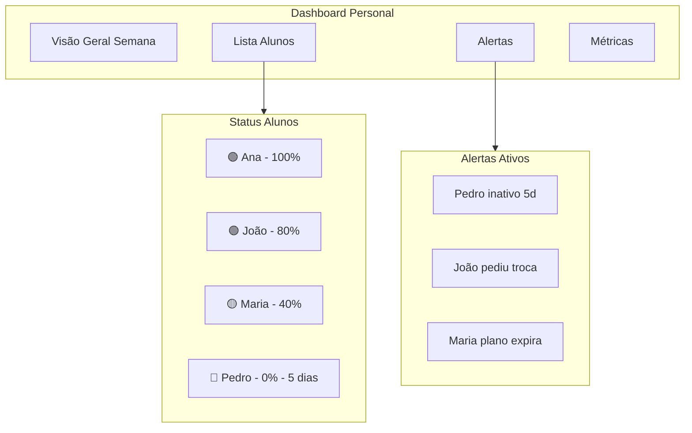
```mermaid
flowchart TD
    subgraph dashboard[Dashboard Personal]
        A[Visão Geral Semana]
        B[Lista Alunos]
        C[Alertas]
        D[Métricas]
    end

    subgraph alunos[Status Alunos]
        B1[🟢 Ana - 100%]
        B2[🟢 João - 80%]
        B3[🟡 Maria - 40%]
        B4[🔴 Pedro - 0% - 5 dias]
    end

    subgraph alertas[Alertas Ativos]
        C1[Pedro inativo 5d]
        C2[João pediu troca]
        C3[Maria plano expira]
    end

    B --> alunos
    C --> alertas
```

### 5.5 Co-treino em Tempo Real

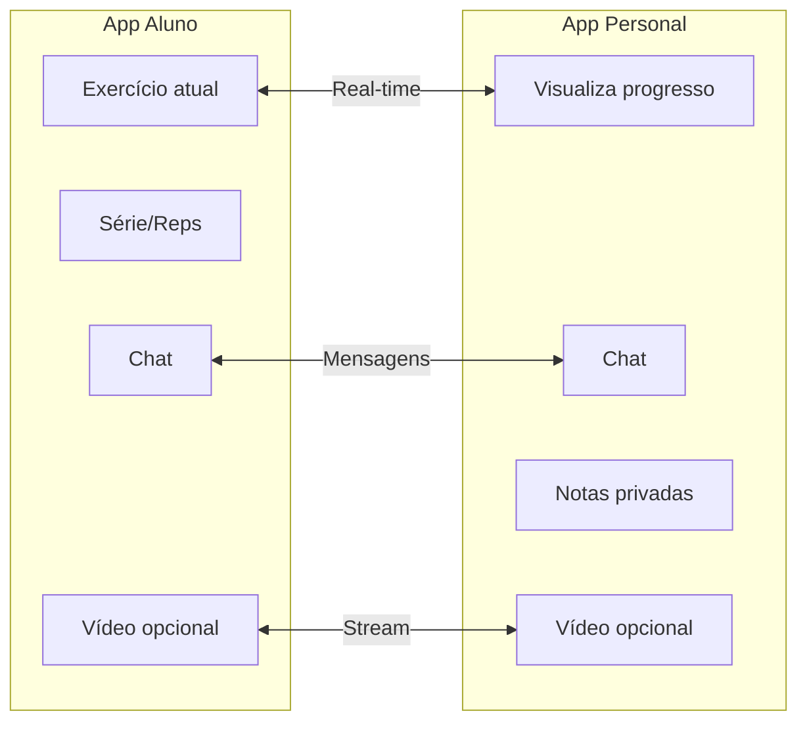
```mermaid
flowchart LR
    subgraph aluno[App Aluno]
        A1[Exercício atual]
        A2[Série/Reps]
        A3[Chat]
        A4[Vídeo opcional]
    end

    subgraph personal[App Personal]
        P1[Visualiza progresso]
        P2[Chat]
        P3[Notas privadas]
        P4[Vídeo opcional]
    end

    A1 <-->|Real-time| P1
    A3 <-->|Mensagens| P2
    A4 <-->|Stream| P4
```

---

## 6. Jornada de Notificações

### 6.1 Categorias e Prioridades

```mermaid
flowchart TD
    subgraph criticas[CRÍTICAS - Sempre ativas]
        A1[Novo plano prescrito]
        A2[Convite recebido]
        A3[Assinatura expirando]
        A4[Pagamento atrasado]
    end

    subgraph altas[ALTA - Importantes]
        B1[Nova mensagem]
        B2[Resposta troca exercício]
        B3[Aluno inativo]
        B4[Plano expirando]
        B5[Streak em risco]
    end

    subgraph medias[MÉDIA - Informativas]
        C1[Treino concluído]
        C2[Conquista desbloqueada]
        C3[Nota do Personal]
        C4[Atualização plano]
    end

    subgraph baixas[BAIXA - Opcionais]
        D1[Streak mantido]
        D2[Dica do dia]
    end
```

### 6.2 Lembrete Inteligente de Treino

```mermaid
flowchart TD
    subgraph fatores[Fatores Considerados]
        A[Preferência Aluno]
        B[Histórico Treino]
        C[Config Personal]
        D[Contexto]
    end

    A --> E[Algoritmo]
    B --> E
    C --> E
    D --> E

    E --> F[Horário Ideal]
    F --> G[Envia Lembrete]

    G --> H{Ação do Aluno}
    H -->|Começar| I[Inicia treino]
    H -->|Lembrar depois| J[Reagenda]
    H -->|Ignorar| K[Registra]
```

### 6.3 Fluxo de Notificação

```mermaid
sequenceDiagram
    participant S as Sistema
    participant A as App Aluno
    participant P as App Personal

    Note over S: Evento: Treino concluído
    S->>A: Push notification
    S->>P: Push notification
    A->>A: Badge atualiza
    P->>P: Dashboard atualiza

    Note over S: Evento: Aluno inativo 5d
    S->>P: Push + Alerta dashboard
    P->>A: Personal envia mensagem
```

### 6.4 Configurações do Usuário

```mermaid
flowchart TD
    subgraph config[Configurações Notificações]
        A[Treinos]
        B[Comunicação]
        C[Gamificação]
        D[Pagamentos]
        E[Modo Não Perturbe]
    end

    subgraph treinos[Treinos]
        A1[Lembrete ON/OFF]
        A2[Horário preferido]
        A3[Antecedência]
    end

    subgraph comunicacao[Comunicação]
        B1[Mensagens Personal ON]
        B2[Notas ON/OFF]
    end

    subgraph gamificacao[Gamificação]
        C1[Conquistas ON/OFF]
        C2[Streaks ON/OFF]
    end

    A --> treinos
    B --> comunicacao
    C --> gamificacao
```

---

## Diagrama de Relacionamento Geral

```mermaid
flowchart TD
    subgraph usuarios[Usuários]
        P[Personal]
        A[Aluno]
    end

    subgraph acoes[Ações Principais]
        P -->|Cria| PL[Planos]
        P -->|Convida| A
        P -->|Prescreve| PR[Prescrição]
        P -->|Monitora| AC[Acompanhamento]

        A -->|Aceita convite| P
        A -->|Recebe| PR
        A -->|Executa| TR[Treino]
        A -->|Dá feedback| FB[Feedback]
    end

    subgraph sistema[Sistema]
        PL --> PR
        PR --> TR
        TR --> AC
        FB --> AC
        AC --> NT[Notificações]
        NT --> P
        NT --> A
    end
```

---

## Notas de Implementação

- **Vídeo chamada** (seção 5.5): Aparece nos diagramas de co-treino como "opcional" — não implementado, backlog
- **Templates comunidade** (seção 3.1): Marcado como "futuro" no diagrama, não implementado
- **Pagamentos** (seção 6.1): Notificações de pagamento nos diagramas, módulo de pagamentos ainda não implementado
- **Lembrete inteligente com ML** (seção 6.2): Implementado com lógica baseada em preferência do aluno; ML avançado é backlog

---

## Como usar estes diagramas

1. **Mermaid Live Editor**: https://mermaid.live
   - Cole o código entre \`\`\`mermaid e \`\`\`
   - Exporte como PNG, SVG ou PDF

2. **VS Code**:
   - Instale "Markdown Preview Mermaid Support"
   - Abra preview do arquivo .md

3. **Notion**:
   - Cole o código em bloco de código tipo "mermaid"

4. **Figma/FigJam**:
   - Exporte como SVG do mermaid.live
   - Importe no Figma

5. **Draw.io**:
   - Arranjos > Inserir > Avançado > Mermaid
