# Diagramas de Sequência - Jornadas MyFit

Este documento contém os diagramas de sequência Mermaid para as 6 jornadas principais do MyFit.

---

## 1. Jornada de Cadastro

### 1.1 Cadastro Personal

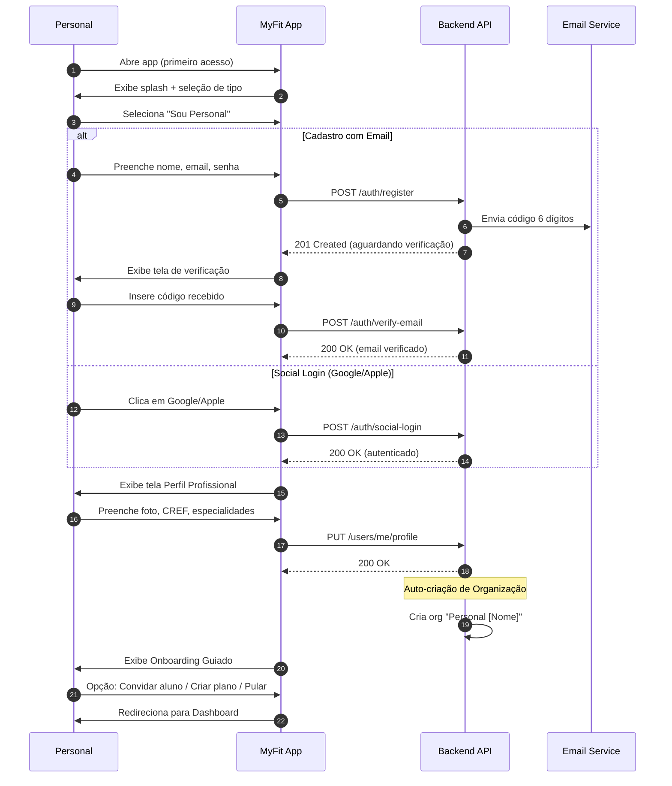
```mermaid
sequenceDiagram
    autonumber
    participant P as Personal
    participant App as MyFit App
    participant API as Backend API
    participant Email as Email Service

    P->>App: Abre app (primeiro acesso)
    App->>P: Exibe splash + seleção de tipo
    P->>App: Seleciona "Sou Personal"

    alt Cadastro com Email
        P->>App: Preenche nome, email, senha
        App->>API: POST /auth/register
        API->>Email: Envia código 6 dígitos
        API-->>App: 201 Created (aguardando verificação)
        App->>P: Exibe tela de verificação
        P->>App: Insere código recebido
        App->>API: POST /auth/verify-email
        API-->>App: 200 OK (email verificado)
    else Social Login (Google/Apple)
        P->>App: Clica em Google/Apple
        App->>API: POST /auth/social-login
        API-->>App: 200 OK (autenticado)
    end

    App->>P: Exibe tela Perfil Profissional
    P->>App: Preenche foto, CREF, especialidades
    App->>API: PUT /users/me/profile
    API-->>App: 200 OK

    Note over API: Auto-criação de Organização
    API->>API: Cria org "Personal [Nome]"

    App->>P: Exibe Onboarding Guiado
    P->>App: Opção: Convidar aluno / Criar plano / Pular
    App->>P: Redireciona para Dashboard
```

### 1.2 Cadastro Aluno (Via Convite)

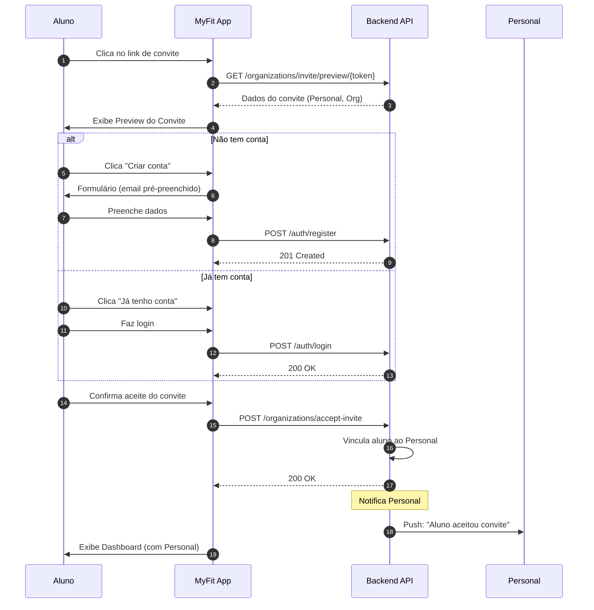
```mermaid
sequenceDiagram
    autonumber
    participant A as Aluno
    participant App as MyFit App
    participant API as Backend API
    participant P as Personal

    A->>App: Clica no link de convite
    App->>API: GET /organizations/invite/preview/{token}
    API-->>App: Dados do convite (Personal, Org)
    App->>A: Exibe Preview do Convite

    alt Não tem conta
        A->>App: Clica "Criar conta"
        App->>A: Formulário (email pré-preenchido)
        A->>App: Preenche dados
        App->>API: POST /auth/register
        API-->>App: 201 Created
    else Já tem conta
        A->>App: Clica "Já tenho conta"
        A->>App: Faz login
        App->>API: POST /auth/login
        API-->>App: 200 OK
    end

    A->>App: Confirma aceite do convite
    App->>API: POST /organizations/accept-invite
    API->>API: Vincula aluno ao Personal
    API-->>App: 200 OK

    Note over API: Notifica Personal
    API->>P: Push: "Aluno aceitou convite"

    App->>A: Exibe Dashboard (com Personal)
```

### 1.3 Cadastro Aluno (Direto - Freemium)

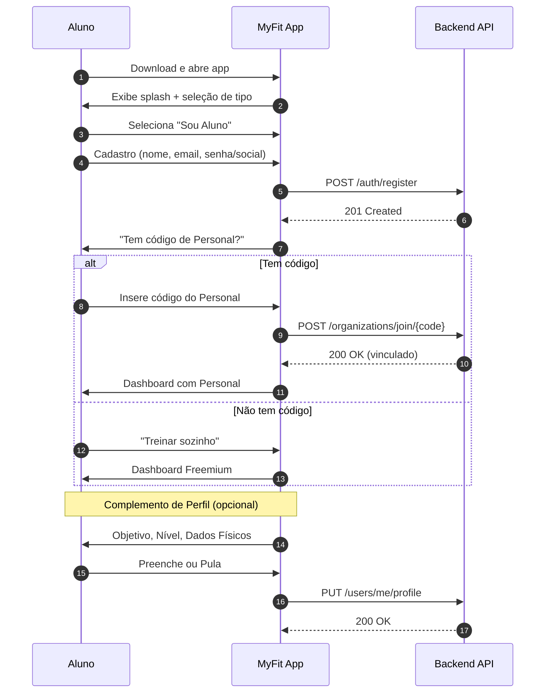
```mermaid
sequenceDiagram
    autonumber
    participant A as Aluno
    participant App as MyFit App
    participant API as Backend API

    A->>App: Download e abre app
    App->>A: Exibe splash + seleção de tipo
    A->>App: Seleciona "Sou Aluno"

    A->>App: Cadastro (nome, email, senha/social)
    App->>API: POST /auth/register
    API-->>App: 201 Created

    App->>A: "Tem código de Personal?"

    alt Tem código
        A->>App: Insere código do Personal
        App->>API: POST /organizations/join/{code}
        API-->>App: 200 OK (vinculado)
        App->>A: Dashboard com Personal
    else Não tem código
        A->>App: "Treinar sozinho"
        App->>A: Dashboard Freemium
    end

    Note over App,A: Complemento de Perfil (opcional)
    App->>A: Objetivo, Nível, Dados Físicos
    A->>App: Preenche ou Pula
    App->>API: PUT /users/me/profile
    API-->>App: 200 OK
```

---

## 2. Jornada de Convites

### 2.1 Personal Envia Convite

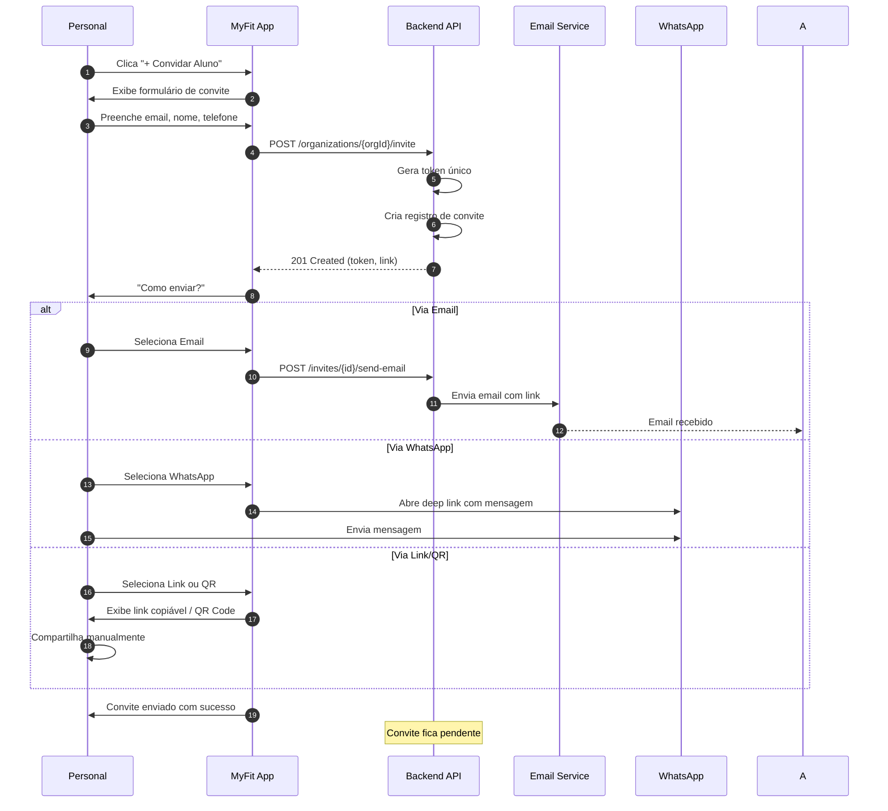
```mermaid
sequenceDiagram
    autonumber
    participant P as Personal
    participant App as MyFit App
    participant API as Backend API
    participant Email as Email Service
    participant WhatsApp as WhatsApp

    P->>App: Clica "+ Convidar Aluno"
    App->>P: Exibe formulário de convite
    P->>App: Preenche email, nome, telefone

    App->>API: POST /organizations/{orgId}/invite
    API->>API: Gera token único
    API->>API: Cria registro de convite
    API-->>App: 201 Created (token, link)

    App->>P: "Como enviar?"

    alt Via Email
        P->>App: Seleciona Email
        App->>API: POST /invites/{id}/send-email
        API->>Email: Envia email com link
        Email-->>A: Email recebido
    else Via WhatsApp
        P->>App: Seleciona WhatsApp
        App->>WhatsApp: Abre deep link com mensagem
        P->>WhatsApp: Envia mensagem
    else Via Link/QR
        P->>App: Seleciona Link ou QR
        App->>P: Exibe link copiável / QR Code
        P->>P: Compartilha manualmente
    end

    App->>P: Convite enviado com sucesso
    Note over API: Convite fica pendente
```

### 2.2 Aluno Recebe e Responde

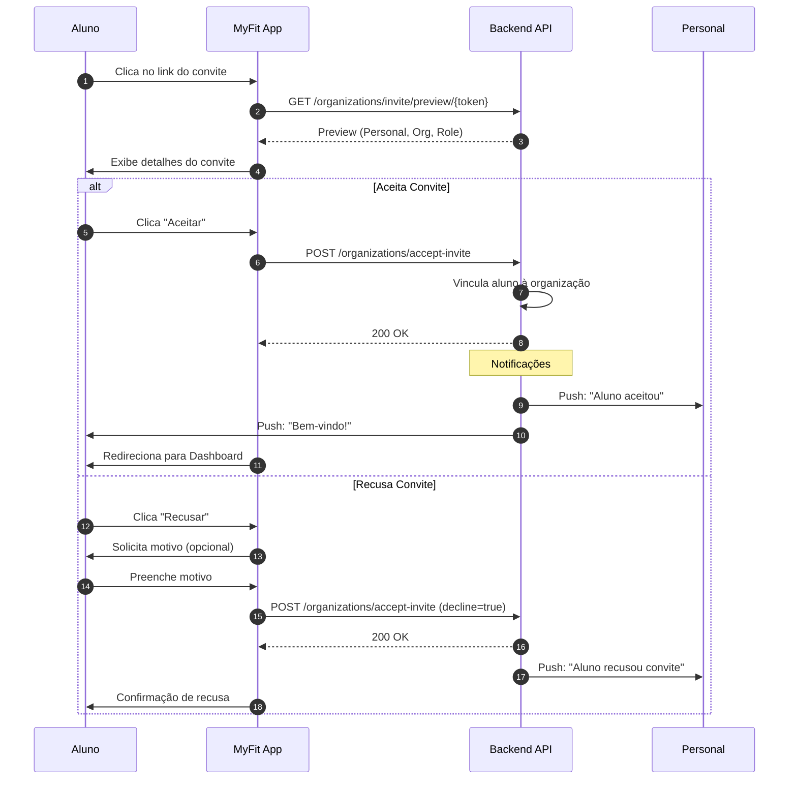
```mermaid
sequenceDiagram
    autonumber
    participant A as Aluno
    participant App as MyFit App
    participant API as Backend API
    participant P as Personal

    A->>App: Clica no link do convite
    App->>API: GET /organizations/invite/preview/{token}
    API-->>App: Preview (Personal, Org, Role)
    App->>A: Exibe detalhes do convite

    alt Aceita Convite
        A->>App: Clica "Aceitar"
        App->>API: POST /organizations/accept-invite
        API->>API: Vincula aluno à organização
        API-->>App: 200 OK

        Note over API: Notificações
        API->>P: Push: "Aluno aceitou"
        API->>A: Push: "Bem-vindo!"

        App->>A: Redireciona para Dashboard

    else Recusa Convite
        A->>App: Clica "Recusar"
        App->>A: Solicita motivo (opcional)
        A->>App: Preenche motivo
        App->>API: POST /organizations/accept-invite (decline=true)
        API-->>App: 200 OK

        API->>P: Push: "Aluno recusou convite"
        App->>A: Confirmação de recusa
    end
```

### 2.3 Sistema de Lembretes

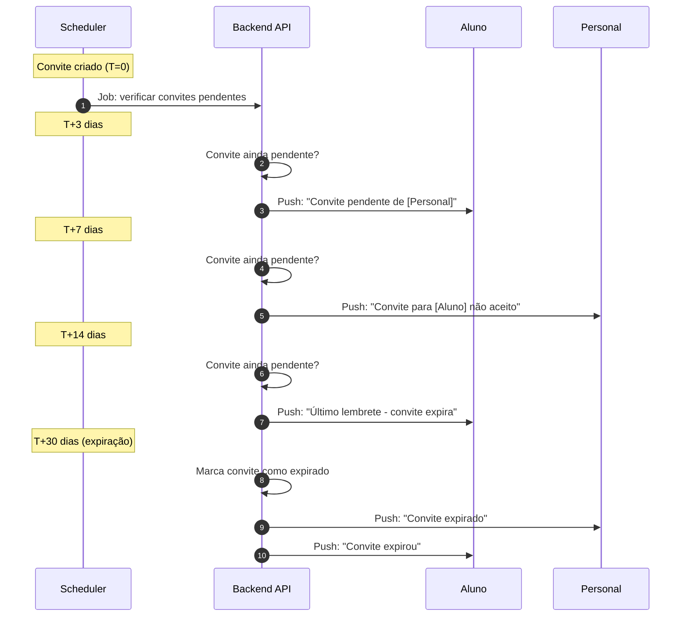
```mermaid
sequenceDiagram
    autonumber
    participant Scheduler as Scheduler
    participant API as Backend API
    participant A as Aluno
    participant P as Personal

    Note over Scheduler: Convite criado (T=0)

    Scheduler->>API: Job: verificar convites pendentes

    Note over Scheduler: T+3 dias
    API->>API: Convite ainda pendente?
    API->>A: Push: "Convite pendente de [Personal]"

    Note over Scheduler: T+7 dias
    API->>API: Convite ainda pendente?
    API->>P: Push: "Convite para [Aluno] não aceito"

    Note over Scheduler: T+14 dias
    API->>API: Convite ainda pendente?
    API->>A: Push: "Último lembrete - convite expira"

    Note over Scheduler: T+30 dias (expiração)
    API->>API: Marca convite como expirado
    API->>P: Push: "Convite expirado"
    API->>A: Push: "Convite expirou"
```

---

## 3. Jornada de Criação de Planos

### 3.1 Criar Plano do Zero

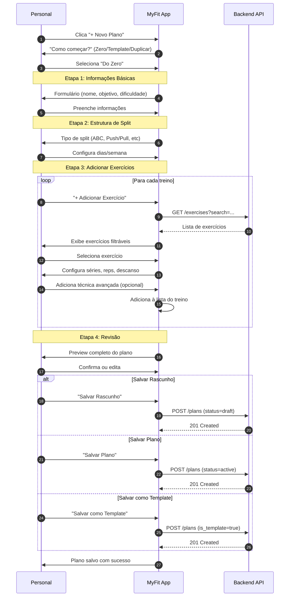
```mermaid
sequenceDiagram
    autonumber
    participant P as Personal
    participant App as MyFit App
    participant API as Backend API

    P->>App: Clica "+ Novo Plano"
    App->>P: "Como começar?" (Zero/Template/Duplicar)
    P->>App: Seleciona "Do Zero"

    Note over App,P: Etapa 1: Informações Básicas
    App->>P: Formulário (nome, objetivo, dificuldade)
    P->>App: Preenche informações

    Note over App,P: Etapa 2: Estrutura de Split
    App->>P: Tipo de split (ABC, Push/Pull, etc)
    P->>App: Configura dias/semana

    Note over App,P: Etapa 3: Adicionar Exercícios
    loop Para cada treino
        P->>App: "+ Adicionar Exercício"
        App->>API: GET /exercises?search=...
        API-->>App: Lista de exercícios
        App->>P: Exibe exercícios filtráveis
        P->>App: Seleciona exercício
        App->>P: Configura séries, reps, descanso
        P->>App: Adiciona técnica avançada (opcional)
        App->>App: Adiciona à lista do treino
    end

    Note over App,P: Etapa 4: Revisão
    App->>P: Preview completo do plano
    P->>App: Confirma ou edita

    alt Salvar Rascunho
        P->>App: "Salvar Rascunho"
        App->>API: POST /plans (status=draft)
        API-->>App: 201 Created
    else Salvar Plano
        P->>App: "Salvar Plano"
        App->>API: POST /plans (status=active)
        API-->>App: 201 Created
    else Salvar como Template
        P->>App: "Salvar como Template"
        App->>API: POST /plans (is_template=true)
        API-->>App: 201 Created
    end

    App->>P: Plano salvo com sucesso
```

### 3.2 Criar Plano de Template

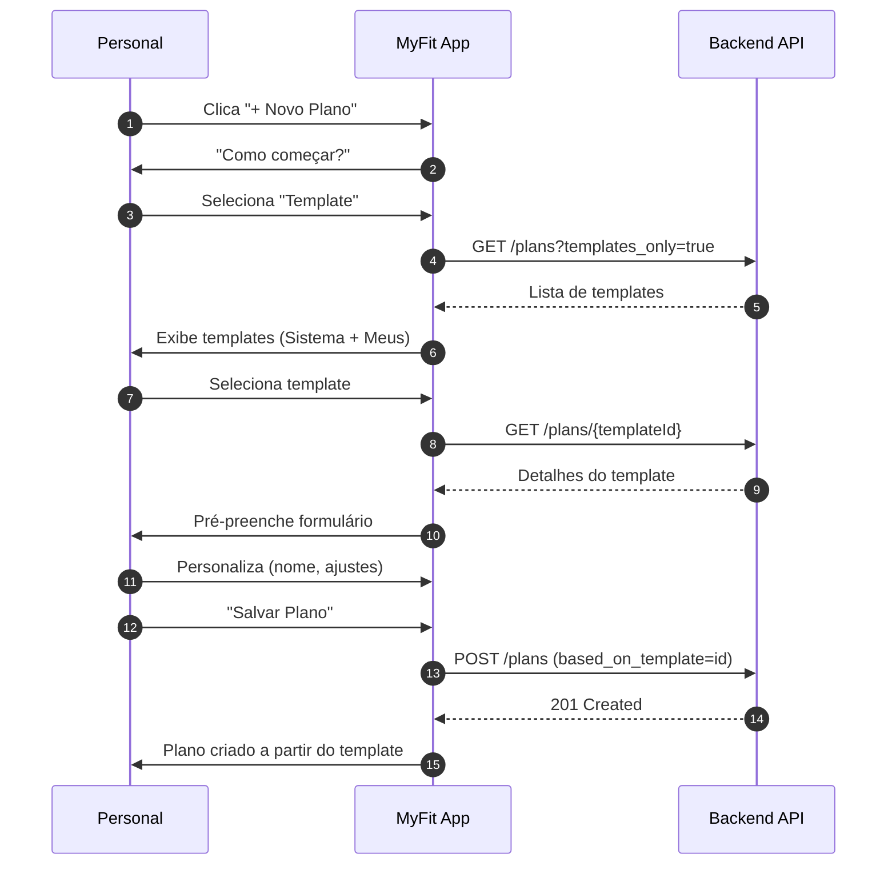
```mermaid
sequenceDiagram
    autonumber
    participant P as Personal
    participant App as MyFit App
    participant API as Backend API

    P->>App: Clica "+ Novo Plano"
    App->>P: "Como começar?"
    P->>App: Seleciona "Template"

    App->>API: GET /plans?templates_only=true
    API-->>App: Lista de templates
    App->>P: Exibe templates (Sistema + Meus)

    P->>App: Seleciona template
    App->>API: GET /plans/{templateId}
    API-->>App: Detalhes do template

    App->>P: Pré-preenche formulário
    P->>App: Personaliza (nome, ajustes)

    P->>App: "Salvar Plano"
    App->>API: POST /plans (based_on_template=id)
    API-->>App: 201 Created

    App->>P: Plano criado a partir do template
```

---

## 4. Jornada de Prescrição

### 4.1 Prescrever Plano Individual

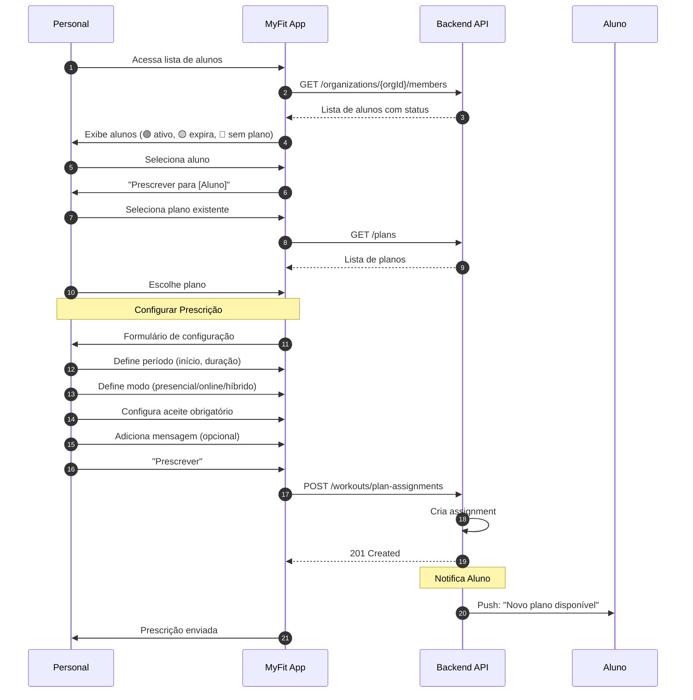
```mermaid
sequenceDiagram
    autonumber
    participant P as Personal
    participant App as MyFit App
    participant API as Backend API
    participant A as Aluno

    P->>App: Acessa lista de alunos
    App->>API: GET /organizations/{orgId}/members
    API-->>App: Lista de alunos com status
    App->>P: Exibe alunos (🟢 ativo, 🟡 expira, 🔴 sem plano)

    P->>App: Seleciona aluno
    App->>P: "Prescrever para [Aluno]"

    P->>App: Seleciona plano existente
    App->>API: GET /plans
    API-->>App: Lista de planos
    P->>App: Escolhe plano

    Note over App,P: Configurar Prescrição
    App->>P: Formulário de configuração
    P->>App: Define período (início, duração)
    P->>App: Define modo (presencial/online/híbrido)
    P->>App: Configura aceite obrigatório
    P->>App: Adiciona mensagem (opcional)

    P->>App: "Prescrever"
    App->>API: POST /workouts/plan-assignments
    API->>API: Cria assignment
    API-->>App: 201 Created

    Note over API: Notifica Aluno
    API->>A: Push: "Novo plano disponível"

    App->>P: Prescrição enviada
```

### 4.2 Aluno Responde à Prescrição

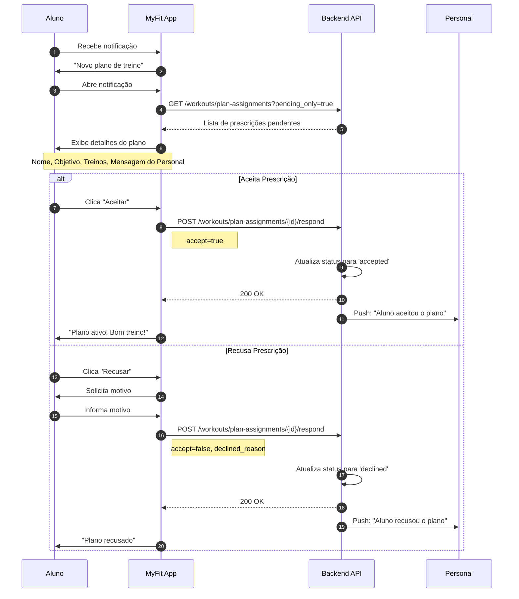
```mermaid
sequenceDiagram
    autonumber
    participant A as Aluno
    participant App as MyFit App
    participant API as Backend API
    participant P as Personal

    A->>App: Recebe notificação
    App->>A: "Novo plano de treino"

    A->>App: Abre notificação
    App->>API: GET /workouts/plan-assignments?pending_only=true
    API-->>App: Lista de prescrições pendentes

    App->>A: Exibe detalhes do plano
    Note over App,A: Nome, Objetivo, Treinos, Mensagem do Personal

    alt Aceita Prescrição
        A->>App: Clica "Aceitar"
        App->>API: POST /workouts/plan-assignments/{id}/respond
        Note right of App: accept=true
        API->>API: Atualiza status para 'accepted'
        API-->>App: 200 OK

        API->>P: Push: "Aluno aceitou o plano"
        App->>A: "Plano ativo! Bom treino!"

    else Recusa Prescrição
        A->>App: Clica "Recusar"
        App->>A: Solicita motivo
        A->>App: Informa motivo
        App->>API: POST /workouts/plan-assignments/{id}/respond
        Note right of App: accept=false, declined_reason
        API->>API: Atualiza status para 'declined'
        API-->>App: 200 OK

        API->>P: Push: "Aluno recusou o plano"
        App->>A: "Plano recusado"
    end
```

### 4.3 Prescrição em Lote

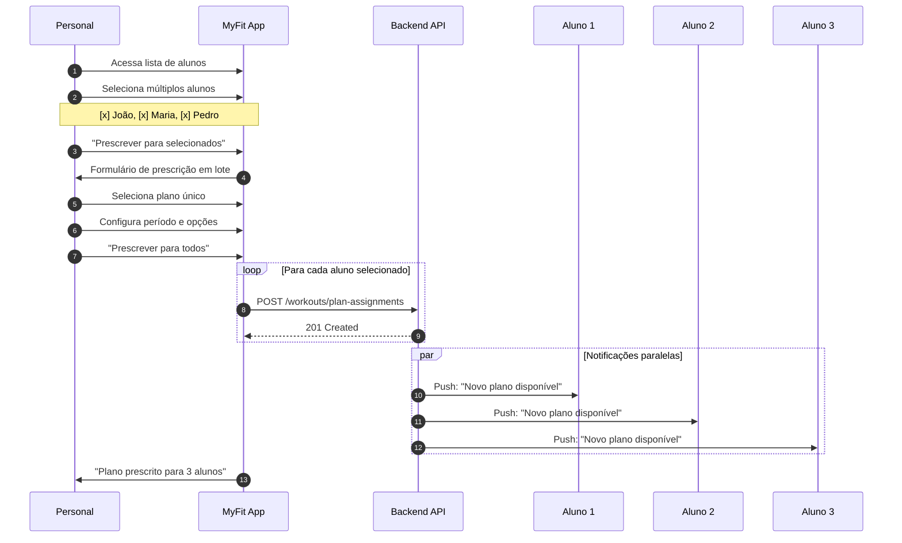
```mermaid
sequenceDiagram
    autonumber
    participant P as Personal
    participant App as MyFit App
    participant API as Backend API
    participant A1 as Aluno 1
    participant A2 as Aluno 2
    participant A3 as Aluno 3

    P->>App: Acessa lista de alunos
    P->>App: Seleciona múltiplos alunos
    Note over App,P: [x] João, [x] Maria, [x] Pedro

    P->>App: "Prescrever para selecionados"
    App->>P: Formulário de prescrição em lote
    P->>App: Seleciona plano único
    P->>App: Configura período e opções

    P->>App: "Prescrever para todos"

    loop Para cada aluno selecionado
        App->>API: POST /workouts/plan-assignments
        API-->>App: 201 Created
    end

    par Notificações paralelas
        API->>A1: Push: "Novo plano disponível"
        API->>A2: Push: "Novo plano disponível"
        API->>A3: Push: "Novo plano disponível"
    end

    App->>P: "Plano prescrito para 3 alunos"
```

---

## 5. Jornada de Acompanhamento

### 5.1 Aluno Executa Treino

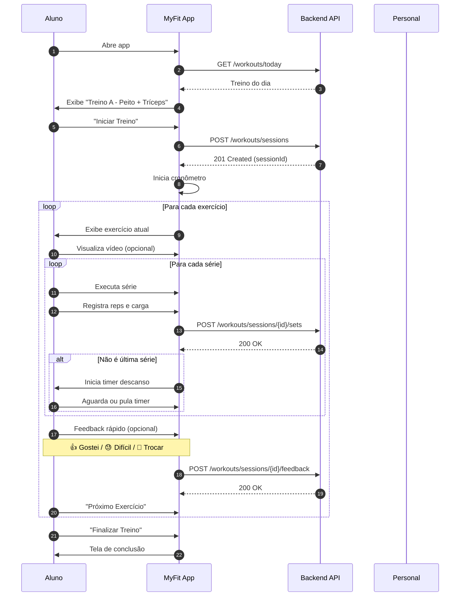
```mermaid
sequenceDiagram
    autonumber
    participant A as Aluno
    participant App as MyFit App
    participant API as Backend API
    participant P as Personal

    A->>App: Abre app
    App->>API: GET /workouts/today
    API-->>App: Treino do dia
    App->>A: Exibe "Treino A - Peito + Tríceps"

    A->>App: "Iniciar Treino"
    App->>API: POST /workouts/sessions
    API-->>App: 201 Created (sessionId)
    App->>App: Inicia cronômetro

    loop Para cada exercício
        App->>A: Exibe exercício atual
        A->>App: Visualiza vídeo (opcional)

        loop Para cada série
            A->>App: Executa série
            A->>App: Registra reps e carga
            App->>API: POST /workouts/sessions/{id}/sets
            API-->>App: 200 OK

            alt Não é última série
                App->>A: Inicia timer descanso
                A->>App: Aguarda ou pula timer
            end
        end

        A->>App: Feedback rápido (opcional)
        Note over App,A: 👍 Gostei / 😓 Difícil / 🔄 Trocar
        App->>API: POST /workouts/sessions/{id}/feedback
        API-->>App: 200 OK

        A->>App: "Próximo Exercício"
    end

    A->>App: "Finalizar Treino"
    App->>A: Tela de conclusão
```

### 5.2 Finalização com Rating

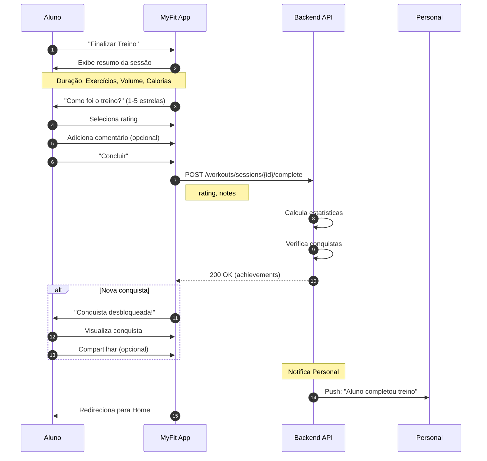
```mermaid
sequenceDiagram
    autonumber
    participant A as Aluno
    participant App as MyFit App
    participant API as Backend API
    participant P as Personal

    A->>App: "Finalizar Treino"
    App->>A: Exibe resumo da sessão
    Note over App,A: Duração, Exercícios, Volume, Calorias

    App->>A: "Como foi o treino?" (1-5 estrelas)
    A->>App: Seleciona rating
    A->>App: Adiciona comentário (opcional)

    A->>App: "Concluir"
    App->>API: POST /workouts/sessions/{id}/complete
    Note right of App: rating, notes
    API->>API: Calcula estatísticas
    API->>API: Verifica conquistas
    API-->>App: 200 OK (achievements)

    alt Nova conquista
        App->>A: "Conquista desbloqueada!"
        A->>App: Visualiza conquista
        A->>App: Compartilhar (opcional)
    end

    Note over API: Notifica Personal
    API->>P: Push: "Aluno completou treino"

    App->>A: Redireciona para Home
```

### 5.3 Co-Treino em Tempo Real

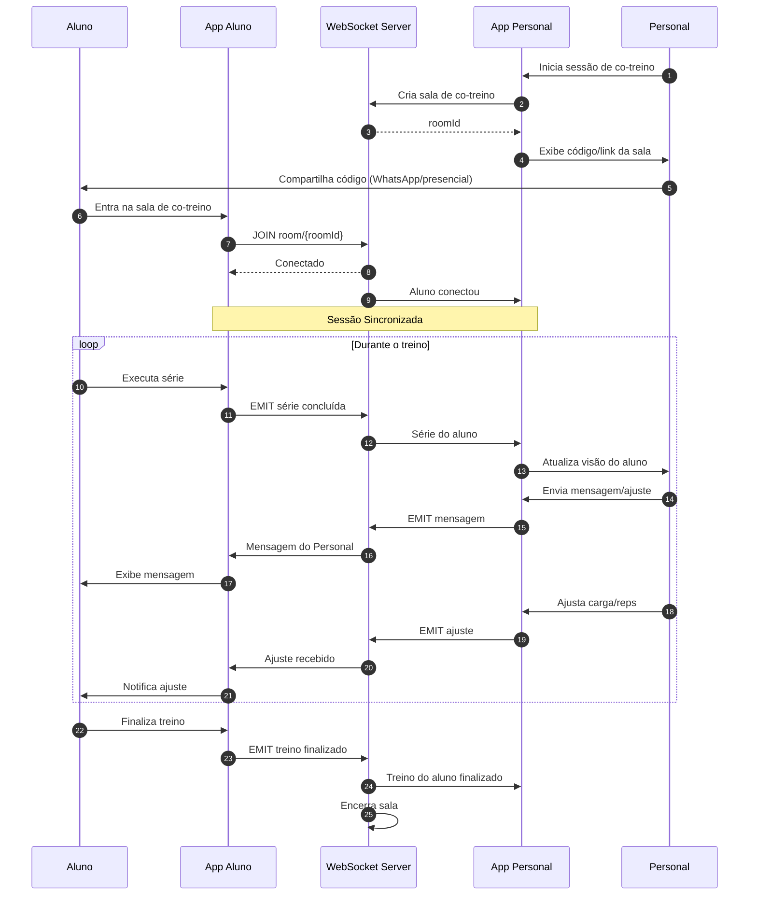
```mermaid
sequenceDiagram
    autonumber
    participant A as Aluno
    participant App_A as App Aluno
    participant WS as WebSocket Server
    participant App_P as App Personal
    participant P as Personal

    P->>App_P: Inicia sessão de co-treino
    App_P->>WS: Cria sala de co-treino
    WS-->>App_P: roomId
    App_P->>P: Exibe código/link da sala

    P->>A: Compartilha código (WhatsApp/presencial)

    A->>App_A: Entra na sala de co-treino
    App_A->>WS: JOIN room/{roomId}
    WS-->>App_A: Conectado
    WS->>App_P: Aluno conectou

    Note over App_A,App_P: Sessão Sincronizada

    loop Durante o treino
        A->>App_A: Executa série
        App_A->>WS: EMIT série concluída
        WS->>App_P: Série do aluno
        App_P->>P: Atualiza visão do aluno

        P->>App_P: Envia mensagem/ajuste
        App_P->>WS: EMIT mensagem
        WS->>App_A: Mensagem do Personal
        App_A->>A: Exibe mensagem

        P->>App_P: Ajusta carga/reps
        App_P->>WS: EMIT ajuste
        WS->>App_A: Ajuste recebido
        App_A->>A: Notifica ajuste
    end

    A->>App_A: Finaliza treino
    App_A->>WS: EMIT treino finalizado
    WS->>App_P: Treino do aluno finalizado
    WS->>WS: Encerra sala
```

### 5.4 Dashboard Personal - Visão de Alunos

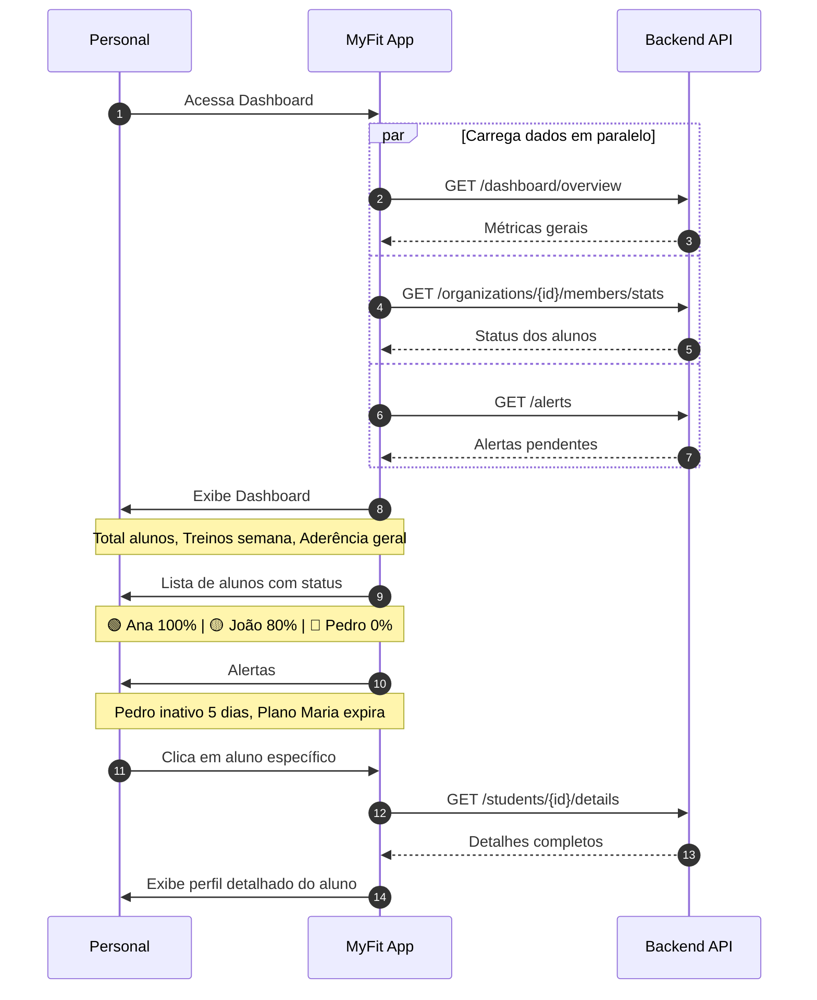
```mermaid
sequenceDiagram
    autonumber
    participant P as Personal
    participant App as MyFit App
    participant API as Backend API

    P->>App: Acessa Dashboard

    par Carrega dados em paralelo
        App->>API: GET /dashboard/overview
        API-->>App: Métricas gerais
    and
        App->>API: GET /organizations/{id}/members/stats
        API-->>App: Status dos alunos
    and
        App->>API: GET /alerts
        API-->>App: Alertas pendentes
    end

    App->>P: Exibe Dashboard
    Note over App,P: Total alunos, Treinos semana, Aderência geral

    App->>P: Lista de alunos com status
    Note over App,P: 🟢 Ana 100% | 🟡 João 80% | 🔴 Pedro 0%

    App->>P: Alertas
    Note over App,P: Pedro inativo 5 dias, Plano Maria expira

    P->>App: Clica em aluno específico
    App->>API: GET /students/{id}/details
    API-->>App: Detalhes completos
    App->>P: Exibe perfil detalhado do aluno
```

---

## 6. Jornada de Notificações

### 6.1 Lembrete Inteligente de Treino

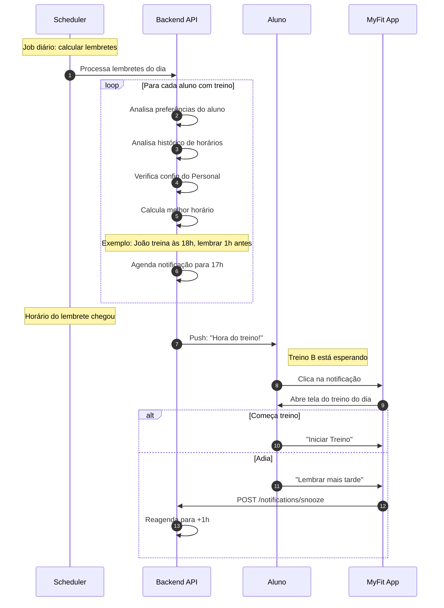
```mermaid
sequenceDiagram
    autonumber
    participant Scheduler as Scheduler
    participant API as Backend API
    participant A as Aluno
    participant App as MyFit App

    Note over Scheduler: Job diário: calcular lembretes

    Scheduler->>API: Processa lembretes do dia

    loop Para cada aluno com treino
        API->>API: Analisa preferências do aluno
        API->>API: Analisa histórico de horários
        API->>API: Verifica config do Personal
        API->>API: Calcula melhor horário

        Note over API: Exemplo: João treina às 18h, lembrar 1h antes

        API->>API: Agenda notificação para 17h
    end

    Note over Scheduler: Horário do lembrete chegou

    API->>A: Push: "Hora do treino!"
    Note right of A: Treino B está esperando

    A->>App: Clica na notificação
    App->>A: Abre tela do treino do dia

    alt Começa treino
        A->>App: "Iniciar Treino"
    else Adia
        A->>App: "Lembrar mais tarde"
        App->>API: POST /notifications/snooze
        API->>API: Reagenda para +1h
    end
```

### 6.2 Fluxo de Notificações do Sistema

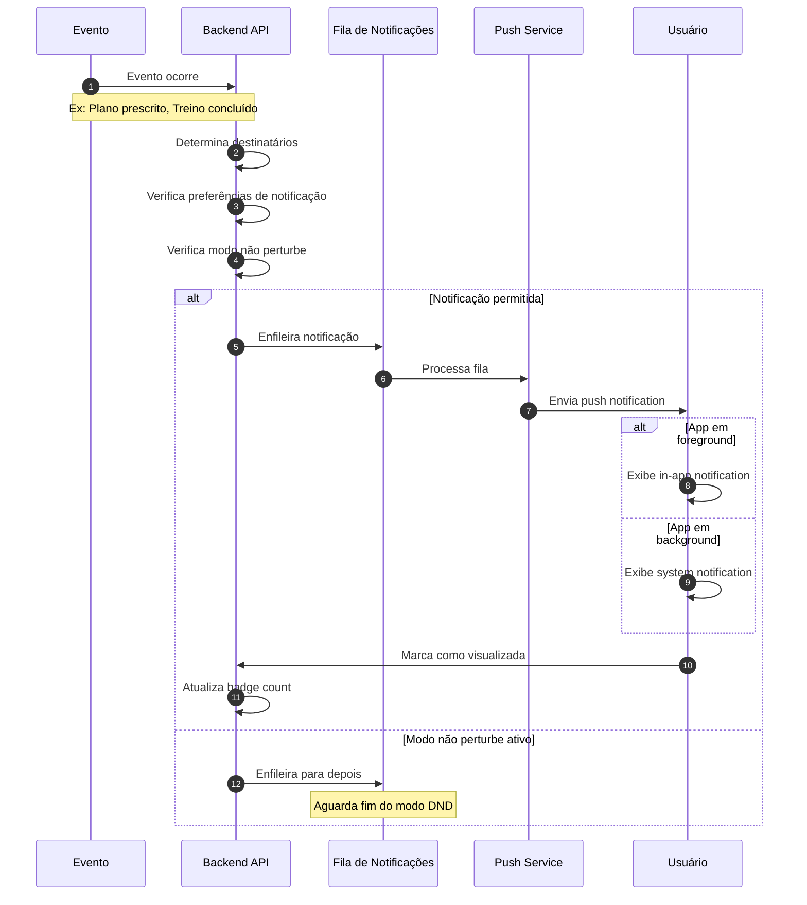
```mermaid
sequenceDiagram
    autonumber
    participant Event as Evento
    participant API as Backend API
    participant Queue as Fila de Notificações
    participant Push as Push Service
    participant User as Usuário

    Event->>API: Evento ocorre
    Note over Event,API: Ex: Plano prescrito, Treino concluído

    API->>API: Determina destinatários
    API->>API: Verifica preferências de notificação
    API->>API: Verifica modo não perturbe

    alt Notificação permitida
        API->>Queue: Enfileira notificação
        Queue->>Push: Processa fila
        Push->>User: Envia push notification

        alt App em foreground
            User->>User: Exibe in-app notification
        else App em background
            User->>User: Exibe system notification
        end

        User->>API: Marca como visualizada
        API->>API: Atualiza badge count

    else Modo não perturbe ativo
        API->>Queue: Enfileira para depois
        Note over Queue: Aguarda fim do modo DND
    end
```

### 6.3 Broadcast do Personal

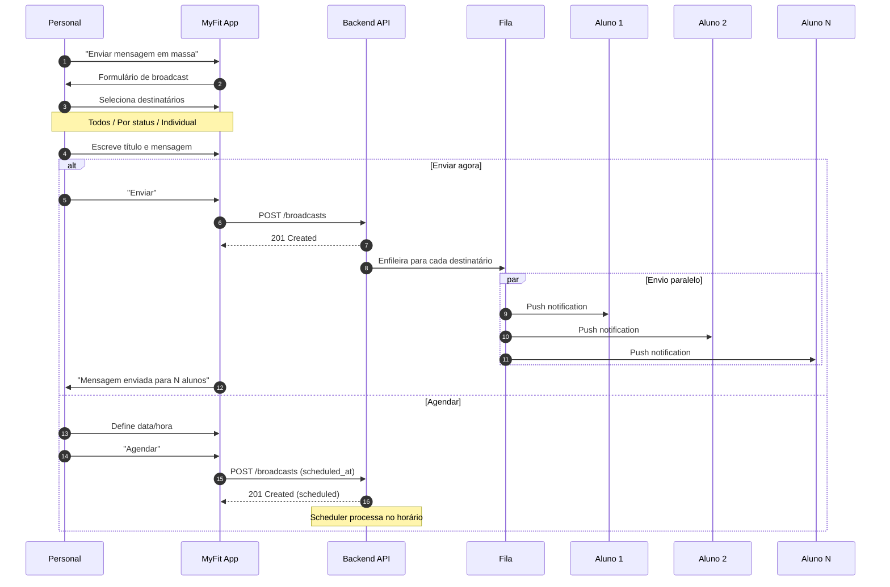
```mermaid
sequenceDiagram
    autonumber
    participant P as Personal
    participant App as MyFit App
    participant API as Backend API
    participant Queue as Fila
    participant A1 as Aluno 1
    participant A2 as Aluno 2
    participant AN as Aluno N

    P->>App: "Enviar mensagem em massa"
    App->>P: Formulário de broadcast

    P->>App: Seleciona destinatários
    Note over App,P: Todos / Por status / Individual

    P->>App: Escreve título e mensagem

    alt Enviar agora
        P->>App: "Enviar"
        App->>API: POST /broadcasts
        API-->>App: 201 Created

        API->>Queue: Enfileira para cada destinatário

        par Envio paralelo
            Queue->>A1: Push notification
            Queue->>A2: Push notification
            Queue->>AN: Push notification
        end

        App->>P: "Mensagem enviada para N alunos"

    else Agendar
        P->>App: Define data/hora
        P->>App: "Agendar"
        App->>API: POST /broadcasts (scheduled_at)
        API-->>App: 201 Created (scheduled)

        Note over API: Scheduler processa no horário
    end
```

### 6.4 Configuração de Preferências

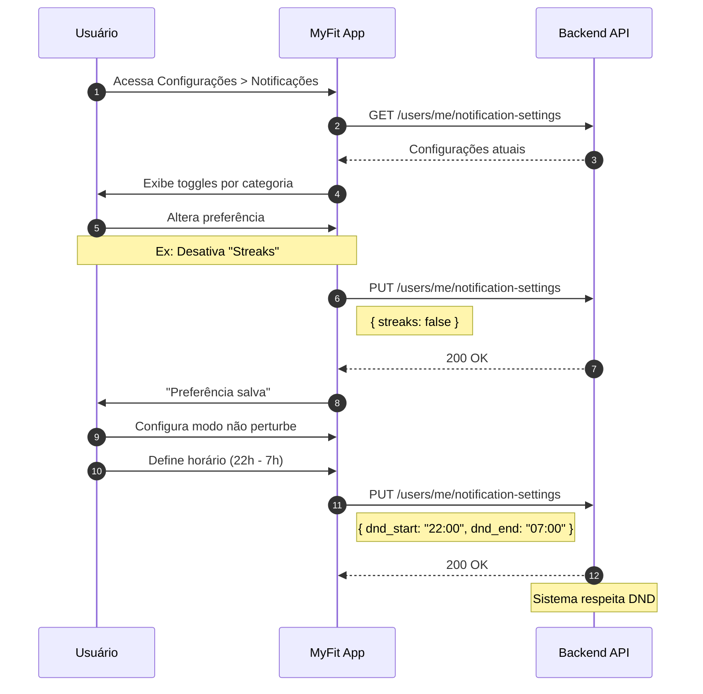
```mermaid
sequenceDiagram
    autonumber
    participant U as Usuário
    participant App as MyFit App
    participant API as Backend API

    U->>App: Acessa Configurações > Notificações
    App->>API: GET /users/me/notification-settings
    API-->>App: Configurações atuais
    App->>U: Exibe toggles por categoria

    U->>App: Altera preferência
    Note over App,U: Ex: Desativa "Streaks"

    App->>API: PUT /users/me/notification-settings
    Note right of App: { streaks: false }
    API-->>App: 200 OK

    App->>U: "Preferência salva"

    U->>App: Configura modo não perturbe
    U->>App: Define horário (22h - 7h)
    App->>API: PUT /users/me/notification-settings
    Note right of App: { dnd_start: "22:00", dnd_end: "07:00" }
    API-->>App: 200 OK

    Note over API: Sistema respeita DND
```

---

## Resumo dos Participantes

| Participante | Descrição |
|--------------|-----------|
| **Personal** | Profissional de educação física |
| **Aluno** | Cliente do Personal |
| **App** | Aplicativo MyFit (Flutter) |
| **API** | Backend (FastAPI) |
| **Email Service** | Serviço de envio de emails |
| **Push Service** | Firebase Cloud Messaging |
| **WebSocket** | Servidor para co-treino real-time |
| **Scheduler** | Jobs agendados (Celery/APScheduler) |
| **Queue** | Fila de processamento assíncrono |

---

## Legenda Mermaid

```
->>  : Requisição síncrona
-->> : Resposta
-x   : Mensagem assíncrona (fire and forget)
Note : Anotação/comentário
alt  : Alternativa (if/else)
loop : Repetição
par  : Execução paralela
```
